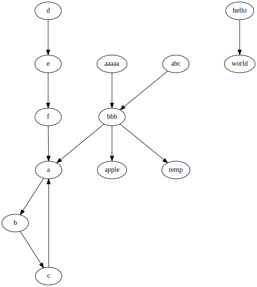

# dotpipe

generate node and edge graph from pipe input

## how to install
```
pip3 install https://github.com/umaumax/dotpipe/archive/master.tar.gz
```

## how to use
```
cat sample.txt | ./dotpipe.py -o out.dot.svg
```

e.g.

input
```
a b
b c
c a
d e
e f
f a
hello world
aaaaa bbb
abc bbb
bbb a apple temp
```

output

